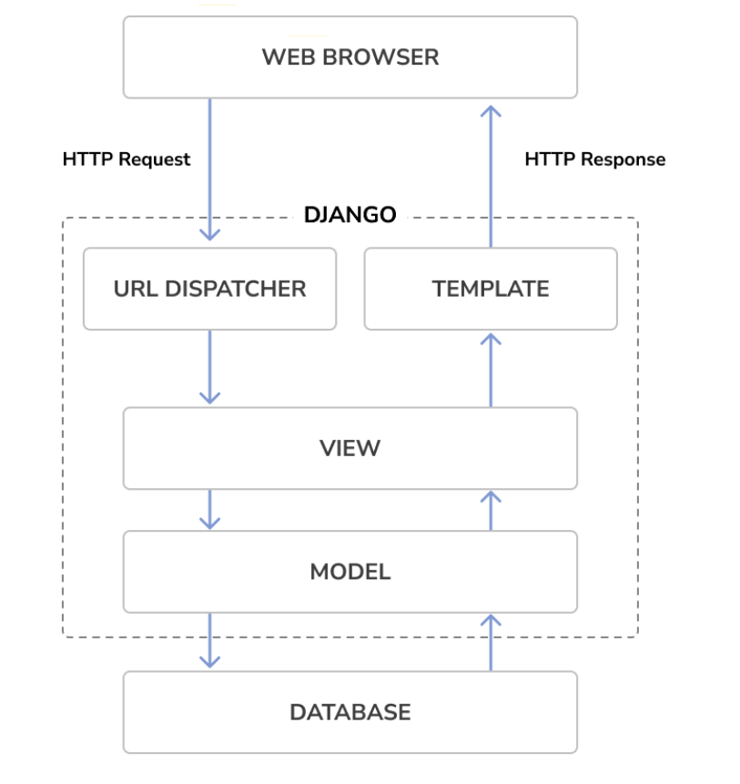
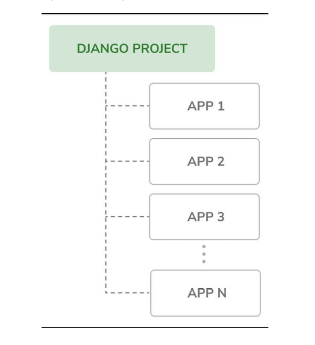

# Kiến trúc của một dự án Django 

- Thành phần của Framework: Django sử dụng mô hình MTV được chia thành những thành phần như sau :   
    1. Model : định nghĩa quan hệ giữa cấu trúc dữ liệu, xử lý dữ liệu giữa Database và View   
    2. Template : lớp dùng để biểu diễn, cũng cấp mọi thứ cho browser render (file html, css)  
    3. View : tương tác giữa cơ sở dữ liệu và chuyển dữ liệu tới Template 
    4. Toàn bộ framework đóng vai như một Controller, lựa chọn đúng view dựa vào url 
- Cấu hình của một tập file được tạo bởi django khi mới init :  
    1. manage.py : sử dụng trong command-line để tương tác với project -> ko cần sửa file này 
    2. __init__ : là file rỗng, dùng để cho python nhận biết rằng thư mục khởi tạo là một module 
    3. asgi.py : 
    4. setting.py : chứa thông tin setting, configuration của dự án 
    5. urls.py : đặt những url được map với hàm view 
    6. wsgi.py : chạy project như là một web server gateway interface (wsgi)

### Dự án sẽ được chia thành nhiều application

- Khi khởi tạo một application, có một số file như sau :  

    | Tên file    | Description |
    | ----------- | ----------- |
    | admin.py    | đăng kí vào django admin site    |
    | app.py   | Chứa main config của app đó         |
    | models.py   | Lưu database schema của app      |
    | tests.py   | File test cho app                 |
    | views.py | chưa hàm cho mỗi  route              |
    | migrations | Thư mục  chứa của app   |
